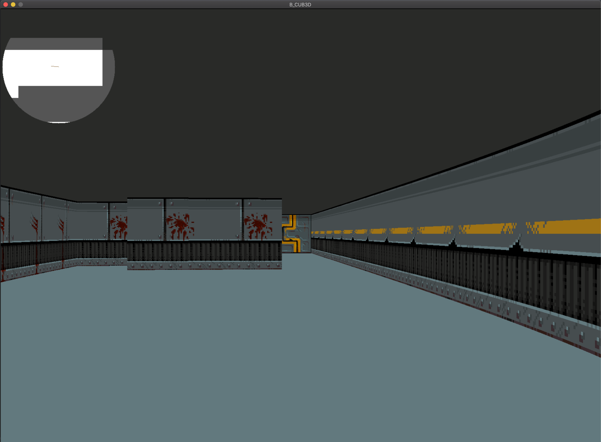
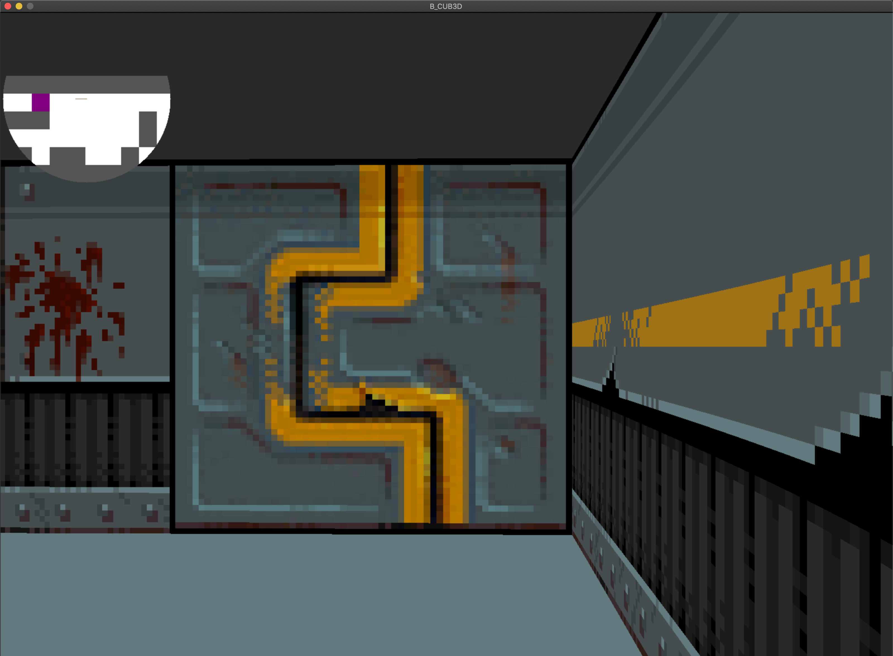
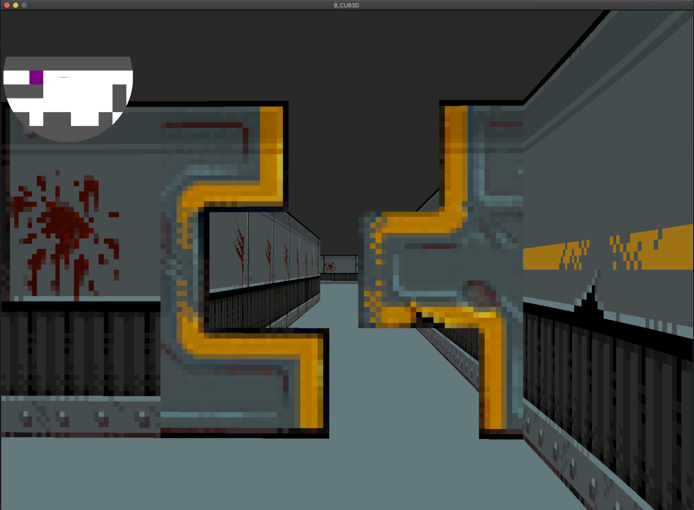

# Cub3d
This project is inspired by the world-famous Wolfenstein 3D game, which was the first FPS ever. It will enable you to explore ray-casting. The goal of the project is to make a dynamic view inside a maze, in which you’ll have to find your way ( The bonus part implements doors also ).

# Version 
🔴 This version is compatible with MacOs only if you want Linux version use Linux branch instead of master.

## Usage :
```bash
git clone https://github.com/marbenMB/Cub3d.git
cd Cub3d
make bonus
./cub3d_bonus map/path
# example
./cub3d_bonus map/bonus/tech_S.cub
``````
### Keys :
````bash
W : go forward
s : go backward
a : go left
d : go right
<- -> and mouse : camera mouvements
1 : display and undisplay minimap
ESC : close
`````
## Overview :



## Doors :


